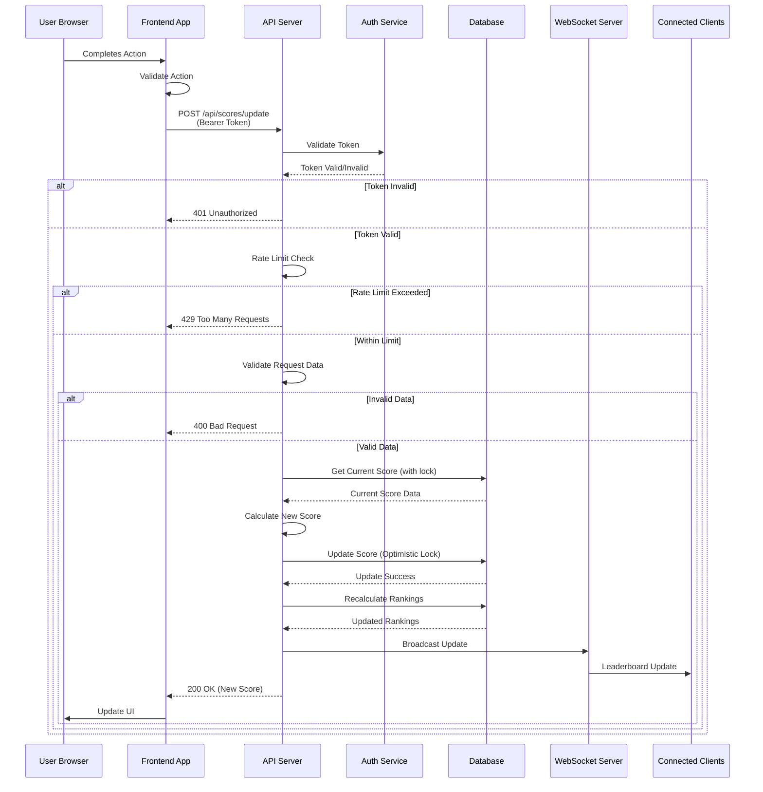

# Scoreboard API Module Specification

## Overview

This document specifies the API service module for a real-time scoreboard system. The module handles score updates, maintains a top 10 leaderboard, and provides live updates to connected clients while ensuring security and preventing unauthorized score manipulation.

## Table of Contents

- [Architecture Overview](#architecture-overview)
- [API Endpoints](#api-endpoints)
- [Authentication & Authorization](#authentication--authorization)
- [Data Models](#data-models)
- [Flow Diagram](#flow-diagram)
- [Implementation Details](#implementation-details)
- [Security Considerations](#security-considerations)
- [Improvements & Recommendations](#improvements--recommendations)

## Architecture Overview

The scoreboard API module consists of the following components:

1. **REST API Server** - Handles HTTP requests for score updates and leaderboard retrieval
2. **WebSocket Server** - Provides real-time updates to connected clients
3. **Database** - Stores user scores and leaderboard data
4. **Authentication Service** - Validates user identity and authorization
5. **Rate Limiting** - Prevents abuse and malicious score manipulation

## API Endpoints

### 1. Update User Score

**Endpoint:** `POST /api/scores/update`

**Description:** Updates a user's score after completing an action.

**Authentication:** Required (Bearer Token)

**Request Headers:**
```
Authorization: Bearer <access_token>
Content-Type: application/json
```

**Request Body:**
```json
{
  "userId": "string (UUID)",
  "scoreIncrement": number,
  "actionId": "string (optional)",
  "timestamp": "ISO 8601 datetime"
}
```

**Response (200 OK):**
```json
{
  "success": true,
  "data": {
    "userId": "string",
    "newScore": number,
    "previousScore": number,
    "rank": number,
    "isTopTen": boolean
  }
}
```

**Response (400 Bad Request):**
```json
{
  "success": false,
  "error": "Invalid request: scoreIncrement must be positive"
}
```

**Response (401 Unauthorized):**
```json
{
  "success": false,
  "error": "Invalid or expired token"
}
```

**Response (403 Forbidden):**
```json
{
  "success": false,
  "error": "User not authorized to update this score"
}
```

**Response (429 Too Many Requests):**
```json
{
  "success": false,
  "error": "Rate limit exceeded. Please try again later."
}
```

### 2. Get Top 10 Leaderboard

**Endpoint:** `GET /api/scores/leaderboard`

**Description:** Retrieves the current top 10 users by score.

**Authentication:** Optional (public endpoint, but authenticated users get additional data)

**Query Parameters:**
- `limit` (optional): Number of results (default: 10, max: 100)
- `offset` (optional): Pagination offset (default: 0)

**Response (200 OK):**
```json
{
  "success": true,
  "data": {
    "leaderboard": [
      {
        "rank": 1,
        "userId": "string",
        "username": "string",
        "score": number,
        "lastUpdated": "ISO 8601 datetime"
      }
    ],
    "totalUsers": number,
    "lastUpdated": "ISO 8601 datetime"
  }
}
```

### 3. Get User Score

**Endpoint:** `GET /api/scores/user/:userId`

**Description:** Retrieves a specific user's score and rank.

**Authentication:** Required (Bearer Token)

**Response (200 OK):**
```json
{
  "success": true,
  "data": {
    "userId": "string",
    "username": "string",
    "score": number,
    "rank": number,
    "isTopTen": boolean,
    "lastUpdated": "ISO 8601 datetime"
  }
}
```

### 4. WebSocket Connection

**Endpoint:** `WS /ws/leaderboard`

**Description:** Establishes a WebSocket connection for real-time leaderboard updates.

**Authentication:** Optional (for personalized updates)

**Connection Message:**
```json
{
  "type": "subscribe",
  "channel": "leaderboard"
}
```

**Server Messages:**

*Leaderboard Update:*
```json
{
  "type": "leaderboard_update",
  "data": {
    "leaderboard": [...],
    "timestamp": "ISO 8601 datetime"
  }
}
```

*User Score Update:*
```json
{
  "type": "score_update",
  "data": {
    "userId": "string",
    "newScore": number,
    "rank": number,
    "isTopTen": boolean
  }
}
```

## Authentication & Authorization

### Token-Based Authentication

The API uses JWT (JSON Web Tokens) for authentication:

1. **Token Structure:**
   ```json
   {
     "userId": "string (UUID)",
     "username": "string",
     "iat": number,
     "exp": number
   }
   ```

2. **Token Validation:**
   - Tokens must be valid and not expired
   - User ID in token must match the userId in the request
   - Token signature must be verified

3. **Authorization Rules:**
   - Users can only update their own scores
   - Admin users can update any user's score (optional)
   - Score increments are validated against business rules

### Rate Limiting

To prevent abuse, implement rate limiting:

- **Score Updates:** 10 requests per minute per user
- **Leaderboard Queries:** 60 requests per minute per IP
- **WebSocket Connections:** 5 concurrent connections per user

## Data Models

### User Score

```typescript
interface UserScore {
  userId: string;           // UUID
  username: string;
  score: number;            // Total score (non-negative)
  rank: number;             // Current rank (1-based)
  lastUpdated: Date;        // Last score update timestamp
  createdAt: Date;         // Account creation timestamp
  version: number;          // Optimistic locking version
}
```

### Score Update Request

```typescript
interface ScoreUpdateRequest {
  userId: string;
  scoreIncrement: number;   // Must be positive
  actionId?: string;        // Optional action identifier
  timestamp: Date;          // Client timestamp (for validation)
  signature?: string;       // Optional HMAC signature
}
```

### Leaderboard Entry

```typescript
interface LeaderboardEntry {
  rank: number;
  userId: string;
  username: string;
  score: number;
  lastUpdated: Date;
}
```

## Flow Diagram



## Implementation Details

### Database Schema

```sql
CREATE TABLE user_scores (
    user_id UUID PRIMARY KEY,
    username VARCHAR(255) NOT NULL,
    score BIGINT NOT NULL DEFAULT 0,
    rank INTEGER NOT NULL,
    last_updated TIMESTAMP NOT NULL DEFAULT CURRENT_TIMESTAMP,
    created_at TIMESTAMP NOT NULL DEFAULT CURRENT_TIMESTAMP,
    version INTEGER NOT NULL DEFAULT 1,
    INDEX idx_score_rank (score DESC, rank ASC),
    INDEX idx_last_updated (last_updated DESC)
);

CREATE TABLE score_history (
    id UUID PRIMARY KEY,
    user_id UUID NOT NULL,
    score_increment INTEGER NOT NULL,
    previous_score BIGINT NOT NULL,
    new_score BIGINT NOT NULL,
    action_id VARCHAR(255),
    timestamp TIMESTAMP NOT NULL DEFAULT CURRENT_TIMESTAMP,
    FOREIGN KEY (user_id) REFERENCES user_scores(user_id),
    INDEX idx_user_timestamp (user_id, timestamp DESC)
);
```

### Score Update Logic

1. **Validation:**
   - Verify token and user authorization
   - Validate scoreIncrement is positive
   - Check rate limits
   - Verify timestamp is recent (prevent replay attacks)

2. **Atomic Update:**
   - Use database transactions with optimistic locking
   - Lock user record during update
   - Calculate new score: `newScore = currentScore + scoreIncrement`
   - Update version number for optimistic locking

3. **Ranking Recalculation:**
   - After score update, recalculate rankings
   - Use efficient algorithm (e.g., Redis sorted sets or database window functions)
   - Update only affected ranks (users near the updated user)

4. **Real-time Broadcast:**
   - If user enters top 10, broadcast to all WebSocket clients
   - If user is already in top 10, broadcast position change
   - Include full leaderboard in broadcast for consistency

### WebSocket Implementation

1. **Connection Management:**
   - Maintain connection pool per user
   - Handle reconnection with exponential backoff
   - Clean up disconnected clients

2. **Message Broadcasting:**
   - Use pub/sub pattern (Redis or message queue)
   - Broadcast only to subscribed clients
   - Throttle updates (max 1 update per second)

3. **Heartbeat:**
   - Send ping every 30 seconds
   - Close connection if no pong received within 60 seconds

## Security Considerations

### 1. Authentication
- Use HTTPS for all API communications
- Implement token refresh mechanism
- Store tokens securely (httpOnly cookies or secure storage)
- Implement token blacklist for logout

### 2. Authorization
- Verify user can only update their own score
- Implement role-based access control (RBAC) for admin operations
- Validate userId matches authenticated user

### 3. Input Validation
- Validate all input data (type, range, format)
- Sanitize user inputs to prevent injection attacks
- Validate score increments are within reasonable bounds
- Reject negative or zero score increments

### 4. Rate Limiting
- Implement per-user rate limiting
- Use sliding window algorithm
- Return appropriate 429 status with Retry-After header
- Log rate limit violations for monitoring

### 5. Replay Attack Prevention
- Include timestamp in requests
- Reject requests with timestamps older than 5 minutes
- Use nonce or request ID to prevent duplicate processing
- Implement idempotency keys for critical operations

### 6. Score Manipulation Prevention
- Server-side validation of all score updates
- Log all score changes for audit trail
- Implement anomaly detection (unusual score patterns)
- Set maximum score increment per request
- Implement cooldown periods between updates

### 7. Data Integrity
- Use database transactions for atomic operations
- Implement optimistic locking to prevent race conditions
- Regular backups of score data
- Audit trail for all score changes

## Improvements & Recommendations

### 1. Caching Strategy
- **Redis Cache:** Cache top 10 leaderboard with 1-second TTL
- **User Score Cache:** Cache individual user scores with 5-second TTL
- **Invalidation:** Invalidate cache on score updates
- **Benefits:** Reduces database load, improves response times

### 2. Database Optimization
- **Indexing:** Ensure proper indexes on score and rank columns
- **Partitioning:** Consider partitioning by date for score_history table
- **Read Replicas:** Use read replicas for leaderboard queries
- **Connection Pooling:** Implement proper connection pooling

### 3. Real-time Updates Enhancement
- **Selective Broadcasting:** Only broadcast when top 10 changes
- **Delta Updates:** Send only changed entries instead of full leaderboard
- **Compression:** Compress WebSocket messages for large leaderboards
- **Client-side Buffering:** Buffer updates on client to handle bursts

### 4. Monitoring & Observability
- **Metrics:** Track API response times, error rates, WebSocket connections
- **Logging:** Structured logging for all score updates and errors
- **Alerting:** Alert on unusual score patterns or high error rates
- **Dashboard:** Real-time dashboard for system health

### 5. Scalability Improvements
- **Horizontal Scaling:** Stateless API servers behind load balancer
- **Message Queue:** Use message queue (RabbitMQ, Kafka) for score updates
- **Database Sharding:** Shard by user_id for large user bases
- **CDN:** Use CDN for static leaderboard data

### 6. Additional Features
- **Score History:** API endpoint to retrieve user's score history
- **Achievements:** Badge/achievement system for milestones
- **Time-based Leaderboards:** Daily, weekly, monthly leaderboards
- **Social Features:** Share achievements, compare with friends

### 7. Testing Strategy
- **Unit Tests:** Test score calculation, ranking logic
- **Integration Tests:** Test API endpoints with database
- **Load Tests:** Test under high concurrent update scenarios
- **Security Tests:** Test authentication, authorization, rate limiting

### 8. Documentation
- **API Documentation:** Use OpenAPI/Swagger for interactive docs
- **Code Comments:** Comprehensive inline documentation
- **Architecture Diagrams:** Additional diagrams for system overview
- **Runbooks:** Operational runbooks for common issues

### 9. Error Handling
- **Graceful Degradation:** Fallback to polling if WebSocket fails
- **Retry Logic:** Exponential backoff for transient failures
- **Circuit Breaker:** Prevent cascade failures
- **User-friendly Messages:** Clear error messages for users

### 10. Compliance & Privacy
- **GDPR Compliance:** User data deletion capabilities
- **Data Retention:** Policies for score history retention
- **Privacy Controls:** User preferences for leaderboard visibility
- **Audit Logs:** Comprehensive audit trail for compliance

## Technology Stack Recommendations

- **Runtime:** Node.js 22+ with TypeScript
- **Framework:** Express.js or Fastify
- **Database:** PostgreSQL (primary), Redis (caching)
- **WebSocket:** Socket.io, ws library or pusher
- **Authentication:** JWT with refresh tokens
- **Rate Limiting:** express-rate-limit or redis-rate-limit
- **Message Queue:** Redis Pub/Sub or RabbitMQ
- **Monitoring:** Prometheus + Grafana
- **Logging:** Winston or Pino

## Deployment Considerations

1. **Environment Variables:** All configuration via environment variables
2. **Health Checks:** `/health` endpoint for load balancer
3. **Graceful Shutdown:** Handle SIGTERM for clean shutdown
4. **Containerization:** Docker with multi-stage builds
5. **CI/CD:** Automated testing and deployment pipeline

